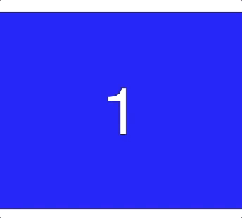

[](https://www.webcomponents.org/element/infinite-carousel-wc) [](https://npmjs.org/package/infinite-carousel-wc)

[](https://circleci.com/gh/wes566/infinite-carousel-wc) [](https://app.netlify.com/sites/infinite-carousel-wc/deploys)

# infinite-carousel-wc

An infinite carousel Web Component built with modern CSS and just a little Javascript. Supports both horizontal and vertical scrolling.



## [Demo](https://infinite-carousel-wc.netlify.com/)

## Installation

You can integrate infinite-carousel-wc via `<script>` tag or via NPM.

### Via `<script>` tag

In the `<head>` of your index.html put a script tag like this:

```html
<script src="https://unpkg.com/infinite-carousel-wc/dist/infinite-carousel-wc.min.js"></script>
```

Now you can use the `infinite-carousel-wc` element anywhere in your html, JSX, template, etc.

### Via NPM

```bash
npm install infinite-carousel-wc --save
```

And then you need to import the module before you can use it in your html/jsx/template:

```js
import "infinite-carousel-wc";
```

NOTE: If you are using (p)react JSX and typescript you might get an error about `<infinite-carousel-wc>` being an unknown type. Until [issue #7 is fixed](https://github.com/wes566/infinite-carousel-wc/issues/7) you can add a type declaration like:

```ts
declare namespace JSX {
  interface IntrinsicElements {
    "infinite-carousel-wc": any;
  }
}
```

## Polyfills

This custom element uses [CSS Scroll Snap](https://caniuse.com/#feat=css-snappoints), [IntersectionObserver](https://caniuse.com/#feat=intersectionobserver) and [Smooth Scrolling](https://caniuse.com/#feat=css-scroll-behavior). Browser support for Scroll Snap is pretty good (this custom element supports both v0 and v1 of the spec). There is a polyfill for [IntersectionObserver](https://github.com/w3c/IntersectionObserver/tree/master/polyfill) and [Smooth Scrolling](https://github.com/iamdustan/smoothscroll).

A note about IntersectionObserver polyfill on iOS: you might need to [configure the polyfill to use polling](https://github.com/w3c/IntersectionObserver/tree/master/polyfill#configuring-the-polyfill) for the carousel to work properly.

## API and Customization

### Slots

The infinite carousel works by laying out 3 slots, with slot names of `1`, `2`, and `3`. The slots will be re-ordered in a circular manner as the user swipes/scrolls.

When inifinite-scroller-wc first renders it will show slot 1 as visible (called the "current" position). Slot 2 will be to the right (in the "next" position), and slot 3 will be to the left (in the "previous" position), like this:

| "previous" | "current" | "next" |
| :--------: | :-------: | :----: |
|     3      |     1     |   2    |

Remember that "current" is the only slot visible to the user at rest. When the user peaks left or right they will then see the "previous" or "next" slot contents respectively.

When the user swipes/scrolls forward then some CSS will get added to the slots to re-order them (technically the CSS is added to the slot's parents which are encapsulated in the shadow DOM). After 1 swipe/scroll it will look like this:

| "previous" | "current" | "next" |
| :--------: | :-------: | :----: |
|     1      |     2     |   3    |

Another swipe forward/next would produce:

| "previous" | "current" | "next" |
| :--------: | :-------: | :----: |
|     2      |     3     |   1    |

Swiping/scrolling backward would do the reverse, as you'd expect.

The circular re-ordering allows the user to swipe/scroll "infinitely" in either direction. It is up to the consuming code to listen for the [`next` or `previous` events](#events). For an example of listening to the event and updating the slot contents [take a look at index.html](./example/index.html#L163).

### Methods

- `goNext()`
  - Scrolls to the next slot.
  - Example: `document.getElementById("carousel").goNext()`
- `goPrevious()`
  - Scrolls to the previous slot.
  - Example: `document.getElementById("carousel").goPrevious()`
- `reset()`
  - Resets the slot order to the initial order. Slot 1 will be in the "current" position, slot 2 will be in the "next" position, and slot 3 will be in the "previous" position.
  - Example: `document.getElementById("carousel").reset()`

### Attributes/Properties

- `vertical`
  - Add this attribute to make your carousel scroll vertically instead of horizontally.
    - Example: `<infinite-carousel-wc vertical></infinite-carousel-wc>`
  - Set the property in Javascript to imperatively set vertical scrolling
    - Example: `carousel.vertical = true`
  - NOTE: Dynamically changing this attribute/property will cause a reset of the slot order (it calls the `reset()` method).
- `lock`
  - Add this attribute to prevent scrolling.
    - Example: `<infinite-carousel-wc lock></infinite-carousel-wc>`
  - Set the property in Javascript to imperatively disable scrolling
    - Example: `carousel.lock = true`

### Events

- `next`
  - Raised after the user has scrolled to the next slot
  - Raised about 200ms before the user is allowed to scroll again
  - `event.detail` contains an `ChangeEventDetail` object of the following shape:
    ```ts
    export interface ChangeEventDetail {
      newCurrent: 1 | 2 | 3;
    }
    ```
  - `ChangeEventDetail` is an exported type that you can consume if you are writing your code in Typescript.
  - Example: `carousel.addEventListener("next", handleCarouselNext())`
- `previous`
  - Raised after the user has scrolled to the previous slot
  - Raised about 200ms before the user is allowed to scroll again
  - `event.detail` contains an `ChangeEventDetail` object of the following shape:
    ```ts
    export interface ChangeEventDetail {
      newCurrent: 1 | 2 | 3;
    }
    ```
  - `ChangeEventDetail` is an exported type that you can consume if you are writing your code in Typescript.
  - Example: `carousel.addEventListener("previous", handleCarouselPrevious())`

### Styling

You can style the infinite-carousel-wc element as you would any regular element, in CSS. You can see [an example in example.css](./example/example.css#L32).

## Contribute

This project is built with standard HTML/CSS/TS, no frameworks or special web-component compilers here (for maximum simplicity and minimum size). If you want to learn more about writing custom elements see [MDN](https://developer.mozilla.org/en-US/docs/Web/Web_Components/Using_custom_elements) or [this web fundamentals page](https://developers.google.com/web/fundamentals/web-components/).

```bash
npm install
npm start
```

This will start a live-server on port localhost:8080. Any changes you make to files in lib/ or any changes to example/index.html should get live reloaded.
